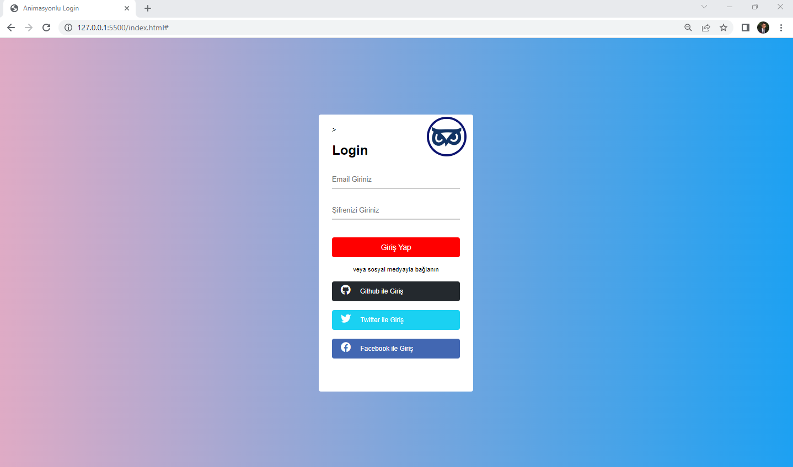
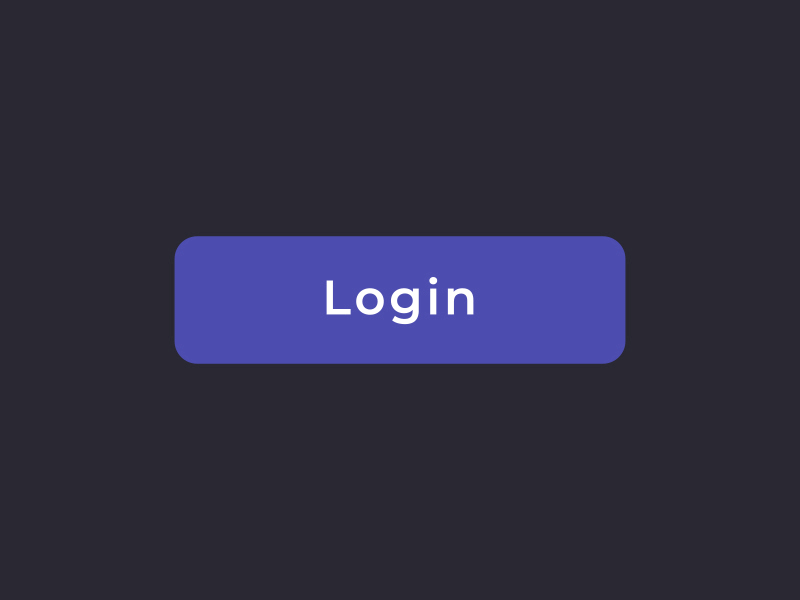

<h1>Login Arayüz Tasarımı</h1>

Yazılım kursunda oluşturduğum ilk projedir.
Bu bir deneme projesi olup statik yapıdadır.

<h2> Kullanılan Teknolojiler</h2>

HTML ve CSS kullanıldı.

<h3>Ekran Görüntüleri</h3>

<h4> Video </h4>

<h4> GIF </h4>

